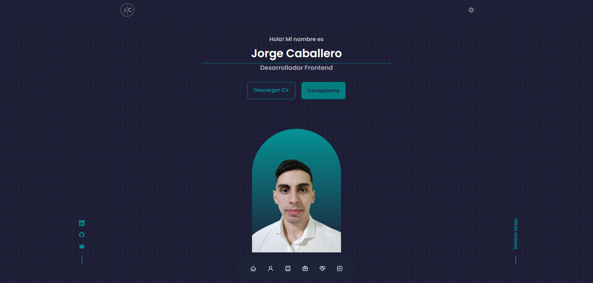

# 🖥️ Portafolio Web - Jorge Caballero 🖥️

## 📚 Preview

## 📚 Descripción del proyecto
- Portafolio web personal, ***responsive design*** desarrollado con ***React JS***, ***Tailwind Css*** y ***Framer Motion***.

- Diseñado con una interfaz de usuario ***agradable y funcional***.

- ***Dark mode*** para el usuario.

## 📚 Tecnologías y herramientas utilizadas
- React Js
- Tailwind Css - Libreria de estilos para React Js
- Framer Motion - Libreria de animaciones para React Js
- Google Fonts - Libreria de fuentes de Google.
- React Icons - Libreria de iconos.
- Swiper Js - Libreria de animaciones - Slider. **(No implementado aún)**

- Aún no se implementó el uso de la libreria de animaciones de Framer Motion.